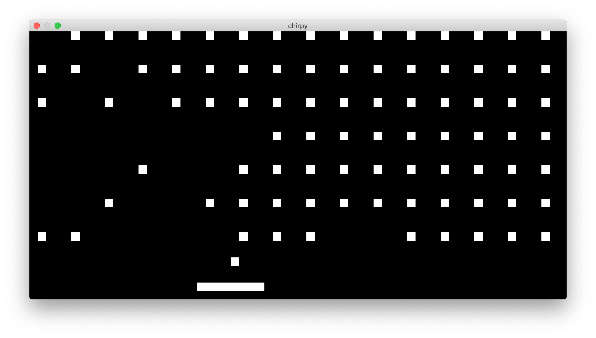

# 👾 chirpy 👾

Hi!

This is chirpy, the happy CHIP-8 interpreter! 😄

It is also my first interpreter/emulator and was made in a day.

It should work cross-platform. ROMs can be loaded by passing the ROM path as the first parameter.

The ROMs I tested seemed to be working fine, however I cannot guarantee it is bug-free. Some of the bitwise operations have tests.

Have fun!